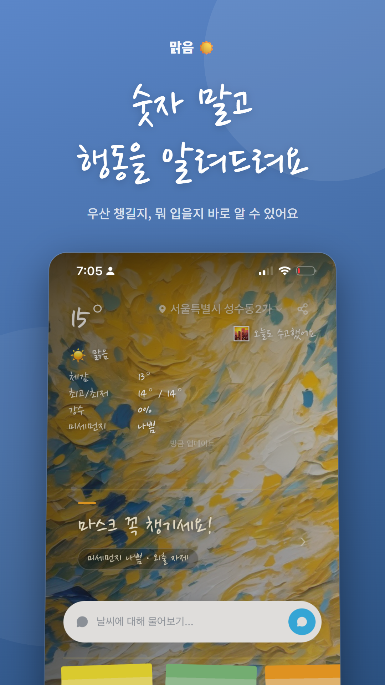
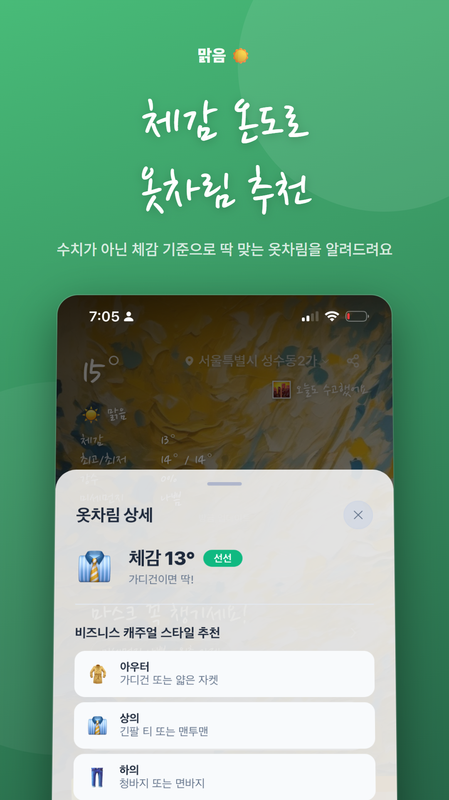
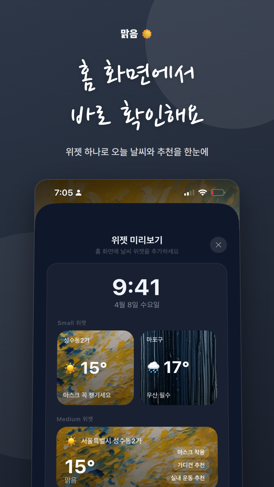
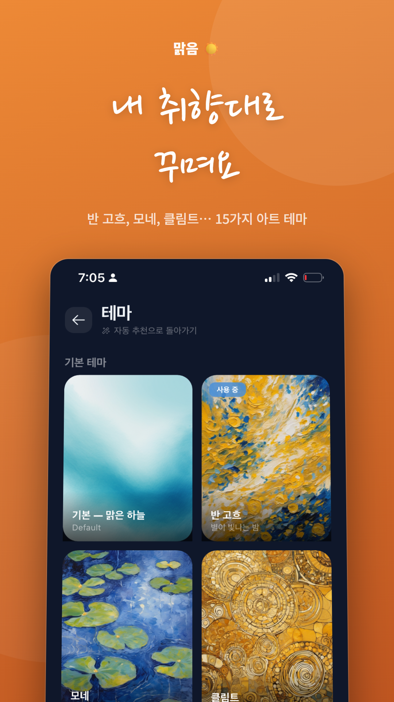

# 맑음 (Malgeum) — 날씨를 보지 말고, 물어보세요

> **우산 챙길까? 뭐 입지? 운동해도 돼?** — 맑음이 답해요.

[](https://play.google.com/store/apps/details?id=gg.pryzm.weather)
[](https://apps.apple.com/kr/app/%EB%A7%91%EC%9D%8C-%EB%82%B4%EA%B8%B0%EB%B6%84/id6761682299)
[](https://www.instagram.com/malgeum.pryzm/)
[](./LICENSE)
[](https://expo.dev/)

오픈소스 React Native 날씨 라이프스타일 앱.

---

## Quick Start

```bash
git clone <your-fork-url> malgeum
cd malgeum
npm install

# 환경변수 설정
cp .env.example .env
# 최소한 EXPO_PUBLIC_WEATHER_API_KEY 와 Firebase 값은 채워야 합니다.

# 개발 서버 실행
npm start         # Expo dev server
npm run android   # Android 빌드/실행
npm run ios       # iOS 빌드/실행 (macOS 필요)

# 검증
npx tsc --noEmit  # 타입 체크
npm test          # Jest 테스트
```

### 필수 준비물

1. **OpenWeatherMap API 키** — 무료. [openweathermap.org](https://openweathermap.org/api)
2. **Firebase 프로젝트** — Anonymous Auth + Firestore 활성화 필요
   - `google-services.json` (Android) / `GoogleService-Info.plist` (iOS) 를 프로젝트 루트에 배치
   - 경로는 `.env`의 `GOOGLE_SERVICES_JSON` / `GOOGLE_SERVICE_INFO_PLIST`로 지정 가능
3. **앱 식별자** — `APP_BUNDLE_ID`, `APP_GROUP_ID`를 본인 값으로 변경 (기본값 `gg.pryzm.malgeum`)

선택:
- RevenueCat (프리미엄 구독), Sentry (에러 추적), AdMob (리워드 광고) — 미설정 시 해당 기능만 비활성화

### License

[MIT](./LICENSE) © 2026 jeonghwan.ko

---

## 맑음이란?

**맑음(Malgeum)** 은 날씨 숫자를 행동으로 번역해주는 AI 날씨 앱입니다.

기온 17도, 강수확률 60% 같은 숫자 대신 **"가디건 챙기고 우산 필수"** 라고 말합니다.  
출근할 때와 퇴근할 때 날씨를 동시에 비교하고, 미세먼지·자외선·꽃가루까지 한 곳에서 확인합니다.  
AI 어시스턴트 **맑음이**에게 자연어로 날씨를 물어보세요 — 감각적인 언어로 답해줍니다.

---

## 스크린샷

<table>
  <tr>
    <td align="center">
      <br/>
      <sub>홈 화면</sub>
    </td>
    <td align="center">
      <br/>
      <sub>AI 맑음이</sub>
    </td>
    <td align="center">
      <br/>
      <sub>주간 예보</sub>
    </td>
    <td align="center">
      <br/>
      <sub>홈 위젯</sub>
    </td>
    <td align="center">
      <br/>
      <sub>아트 테마</sub>
    </td>
  </tr>
</table>

---

## 핵심 기능

### 행동 추천 카드
날씨 데이터를 분석해 **우산 · 옷차림 · 마스크 · 선크림 · 운동 · 세차 · 빨래** 여부를 즉시 알려줍니다.  
강수확률 30% 이상이면 우산, 미세먼지 나쁨이면 마스크, UV 6 이상이면 선크림 알림.  
숫자가 아닌 행동으로 답합니다.

### 출퇴근 날씨 비교
나갈 때(출근)와 올 때(퇴근)의 날씨를 나란히 비교합니다.  
"아침엔 괜찮은데 저녁에 추워져요 — 가디건 들고 가세요" 처럼 시간대별 옷차림 전략을 제시합니다.

### AI 어시스턴트 맑음이
"오늘 빨래 널어도 돼?", "주말에 등산 가도 될까?" 같은 질문을 자연어로 물어보세요.  
음성 입력도 지원합니다. 기형도와 나태주의 감수성으로 날씨를 감각적으로 번역합니다.

### 홈 화면 위젯
Android 2×2 · 4×2 위젯과 iOS WidgetKit을 지원합니다.  
현재 온도, 체감온도, 행동 추천 한 줄을 30분마다 자동 갱신합니다.

### 15가지 아트 테마
반 고흐 · 모네 · 클림트 · 무하 · 팝아트 · 바우하우스 · 우키요에 등 15가지 스타일.  
같은 날씨도 내가 선택한 아트 렌즈로 다르게 봅니다.

### 날씨 알림 6종
출근 30분 전 옷차림 알림, 매일 아침 미세먼지·자외선 요약, 저녁 내일 날씨 예보.  
항목별로 개별 설정 가능합니다.

---

## 다운로드

| 플랫폼 | 링크 |
|--------|------|
| Android (Google Play) | [다운로드](https://play.google.com/store/apps/details?id=gg.pryzm.weather) |
| iOS (App Store) | [다운로드](https://apps.apple.com/kr/app/%EB%A7%91%EC%9D%8C-%EB%82%B4%EA%B8%B0%EB%B6%84/id6761682299) |

---

## 자주 묻는 질문 (FAQ)

**Q. 강수확률 몇 %부터 우산 알림이 오나요?**  
A. 30% 이상이면 우산 추천 카드가 표시됩니다. 50% 이상이면 "우산 필수"로 단계가 올라갑니다.

**Q. 위젯은 어떻게 설정하나요?**  
A. Android는 홈 화면 빈 곳 길게 누르기 → 위젯 → 맑음 선택. iOS는 홈 화면 편집 모드에서 추가하세요. 자세한 방법은 [위젯 설정 가이드](../../wiki/위젯-가이드)를 참고하세요.

**Q. 무료와 프리미엄의 차이는 무엇인가요?**  
A. 무료 버전은 핵심 날씨 기능과 AI 채팅 10회/일과 기본 테마 1가지를 제공합니다. 프리미엄은 15가지 아트 테마 전체와 AI 채팅 무제한을 포함합니다. 월 3,300원입니다.

**Q. AI 맑음이는 어떤 기술을 사용하나요?**  
A. Claude AI를 기반으로 합니다. 현재 날씨 데이터(기온·강수·미세먼지·자외선·꽃가루)와 연동되어 정확한 날씨 맥락에서 답합니다.

**Q. 날씨 데이터는 어디서 가져오나요?**  
A. OpenWeatherMap API를 사용합니다. 현재 날씨, 시간별 예보, 5일 예보, 대기질(미세먼지·초미세먼지·자외선·꽃가루)을 제공합니다.

**Q. 위치 정보를 계속 수집하나요?**  
A. 앱 사용 중에만 위치를 사용합니다(foreground only). 백그라운드에서 위치를 수집하지 않습니다. 위젯 갱신은 앱에 저장된 마지막 위치를 사용합니다.

**Q. 오프라인에서도 사용할 수 있나요?**  
A. 마지막으로 불러온 날씨 데이터를 오프라인에서 볼 수 있습니다. 실시간 업데이트는 인터넷 연결이 필요합니다.

**Q. 여러 지역 날씨를 볼 수 있나요?**  
A. GPS 자동 위치 외에 수동으로 도시를 추가할 수 있습니다. 스와이프로 지역을 전환합니다.

---

## 기술 스택

| 영역 | 기술 |
|------|------|
| 프레임워크 | Expo 54 / React Native 0.81.5 |
| 라우팅 | Expo Router 6 |
| 날씨 API | OpenWeatherMap (현재·예보·대기질) |
| AI | Claude (Anthropic) |
| 결제 | RevenueCat |
| 위젯 | react-native-android-widget + iOS WidgetKit |
| 알림 | expo-notifications |
| 분석 | Firebase Analytics + Sentry |

---

## Wiki

앱 사용 방법과 상세 기능은 [Wiki](../../wiki)에서 확인하세요.

- [기능 소개](../../wiki/기능-소개)
- [AI 어시스턴트 맑음이](../../wiki/AI-어시스턴트-맑음이)
- [위젯 설정 가이드](../../wiki/위젯-가이드)
- [프리미엄 구독](../../wiki/프리미엄-구독)
- [자주 묻는 질문](../../wiki/FAQ)
- [개인정보 및 권한](../../wiki/개인정보-및-권한)

---

## 문의

- 이슈: [GitHub Issues](https://github.com/jeonghwanko/malgeum/issues)
- 이메일: turbo08@gmail.com
- 인스타그램: [@malgeum.pryzm](https://www.instagram.com/malgeum.pryzm/)

---

<p align="center">
  <sub>© 2026 Pryzm. "날씨를 보지 말고, 물어보세요."</sub>
</p>
